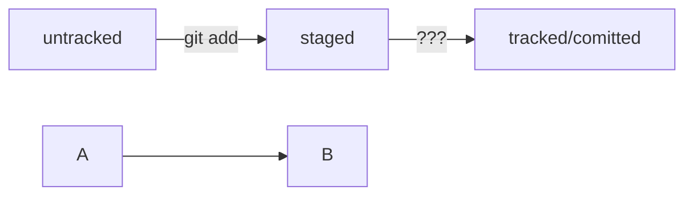

просто текст  
* очень большой  
** болльшой  
*** поменьше  
****** и так далее
__почеркивания__
1. список
2. список
- другой список 
- другой список
~~зачеркнутый текст~~
*курсив*
---
'''
def foo():
    pass
'''
**жирный**
HEAD -- это голова.
Коммит -- это всему голова.
Статусы файлов:
<тут пустая строка!>

```mermaid
%% описание схемы
```
<и тут пустая строка!>


